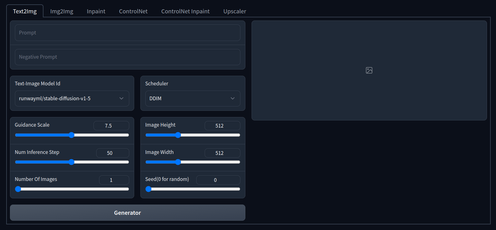

<div align="center">
<h2>
    Diffusion WebUI: Stable Diffusion + ControlNet + Inpaint
</h2>
<h4>
    
<div>
    <a href="https://pepy.tech/project/diffusion-webui"></a>
    <a href="https://badge.fury.io/py/diffusion-webui"></a>
    <a href="https://huggingface.co/spaces/ArtGAN/Stable-Diffusion-ControlNet-WebUI"></a>

</div>
</div>

This repo is a Stable Diffusion + ControlNet + Inpaint WebUI implementation.

### Installation
```bash
pip install diffusion-webui
```
### Usage
```python
from diffusion_webui import app

app()
```
